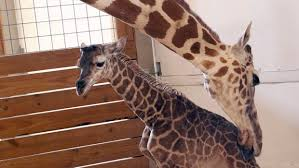

# IS-2.d.01 – Probar de OSINT (Toma de contacto)

**Autor:** Luis Carlos Romero Navarro

---

## Metodologia OSINT

Se ha seguido el ciclo estandar OSINT:

1. **Planificacion**: definicion del objetivo y alcance de cada caso.
2. **Recoleccion**: identificacion de fuentes abiertas relevantes y uso de herramientas OSINT.
3. **Procesamiento**: filtrado y correlacion de la informacion obtenida.
4. **Analisis**: verificacion cruzada y contextualizacion de los datos.
5. **Difusion**: presentacion clara y concisa de resultados y conclusiones.

---

## Caso 1 – Jirafa recien nacida

### Descripcion

Identificar informacion relevante de una jirafa recien nacida que forma parte de un programa de conservacion en cautividad.

### Documentacion del proceso OSINT

**Herramientas y fuentes utilizadas**

- Google Reverse Image Search
- TinEye
- Artículos divulgativos y comunicados públicos de zoológicos acreditados

**Datos recopilados**

- Coincidencias de la imagen en publicaciones previas
- Informacion publica sobre programas de conservacion
- Fecha y lugar de nacimiento de la jirafa

**Analisis realizado**

- Se hizo una busqueda inversa de imagen para localizar coincidencias en medios y repositorios abiertos.
- La imagen coincide con la cria llamada Tajiri, hija de April the Giraffe.
- Se contrazo la informacion con articulos divulgativos y comunicados del parque zoologico.

**Dificultades encontradas y como se superaron**

- Ausencia de metadatos EXIF → se compenso con busqueda inversa y contraste en multiples fuentes
- Alta reutilizacion de imagenes similares → identificacion de rasgos distintivos de la jirafa.

### Tabla de respuestas

| Pregunta                             | Respuesta                                                             |
| ------------------------------------ | --------------------------------------------------------------------- |
| Lugar y fecha de nacimiento          | Animal Adventure Park (Harpursville, Nueva York, EE. UU.), 15/04/2017 |
| Residencia actual y fecha de llegada | Animal Adventure Park, desde su nacimiento                            |
| Fotografía en su hábitat actual      |                                                 |

### Conclusión

La jirafa forma parte de un programa de conservación reconocido mediante fuentes abiertas.

---

## Caso 2 – Verificacion de imagen de ataque en Pakistan

### Descripcion

Analizada la veracidad de una imagen difundida en Twitter que supuestamente muestra un ataque suicida ocurrido en Pakistan.

### Documentacion del proceso OSINT

**Herramientas y fuentes utilizadas**

- Google Reverse Image Search
- TinEye
- Busqueda avanzada en Google (Google Dorks)

**Datos recopilados**

- Publicaciones previas de la imagen en contextos distintos
- Fechas anteriores a enero de 2023
- Caracteristicas del entorno urbano

**Analisis realizado**

- Se realizo busqueda inversa de la imagen.
- Se localizaron coincidencias previas en contextos de conflicto en Siria, anteriores a 2023.
- Se analizo el entorno urbano y los elementos visuales, que no concuerdan con la localizacion dicha.

**Dificultades encontradas y como se superaron**

- Contenido viral con multiples republicaciones → se le da priorizacion a las fuentes mas antiguas
- Falta de contexto original → se reconstruyo mediante archivo historico de imagenes

### Tabla de respuestas

| Pregunta                                  | Respuesta                                                          |
| ----------------------------------------- | ------------------------------------------------------------------ |
| ¿La imagen corresponde al hecho descrito? | No, la imagen no corresponde al ataque que dice que es en Pakistan |

### Conclusion

La imagen fue reutilizada fuera de contexto, constituyendo a la desinformacion .

---

## Caso 3 – Identificacion de estacion de tren

### Descripcion

Con una foto compartida en redes sociales, se solicita identificar la estacion de tren y la estructura mas alta visible.

### Documentacion del proceso OSINT

**Herramientas y fuentes utilizadas**

- Analisis visual de la imagen
- Google Maps / OpenStreetMap
- Imagenes publicas del skyline urbano

**Datos recopilados**

- Senalizacion visible en la estacion
- Diseno ferroviario y material rodante
- Edificios del fondo urbano

**Analisis realizado**

- Identificacion de senalizacion visible en la imagen.
- Comparacion con imagenes publicas y mapas urbanos.
- Analisis del skyline de la ciudad.

**Dificultades encontradas y como se superaron**

- Posible confusion con estaciones similares → Miramos la senalizacion explicita
- Variacion del angulo de la imagen → se contrazo con fotografias desde distintos puntos de vista

### Tabla de respuestas

| Pregunta                    | Respuesta                                      |
| --------------------------- | ---------------------------------------------- |
| Nombre de la estacion       | Flinders Street Station (Melbourne, Australia) |
| Estructura mas alta visible | Eureka Tower                                   |
| Altura de la estructura     | 297 metros                                     |

### Conclusion

La estacion y la estructura se identifican sin ambiguedad mediante elementos visuales.

---

## Caso 4 – Analisis de video de Visit Tirana

### Descripcion

Analizamos un video publicado por la cuenta Visit Tirana para saber la hora aproximada de grabacion y la ubicacion.

### Documentacion del proceso OSINT

**Herramientas y fuentes utilizadas**

- Analisis del tuit original
- Observacion de iluminacion y sombras
- Google Maps / OpenStreetMap

**Datos recopilados**

- Fecha de publicacion del video
- Direccion de sombras y nivel de luz
- Entorno urbano visible durante el recorrido

**Analisis realizado**

- Analisis de la fecha del tuit (16/02/2023).
- Estudio de la iluminacion natural y sombras.
- Comparacion con mapas y recorridos urbanos de Tirana.

**Dificultades encontradas y como se superaron**

- Falta de metadatos del video → analisis de sombras y contexto
- Movimiento continuo de la camara → indentificar puntos de referencia fijos

### Tabla de respuestas

| Pregunta                     | Respuesta            |
| ---------------------------- | -------------------- |
| Hora aproximada de grabacion | Entre 17:00 y 18:00  |
| Coordenadas aproximadas      | 41.3275 N, 19.8187 E |

### Conclusion

El analisis contextual permite determinar con alta fiabilidad la franja horaria y la ubicacion del video.

---
